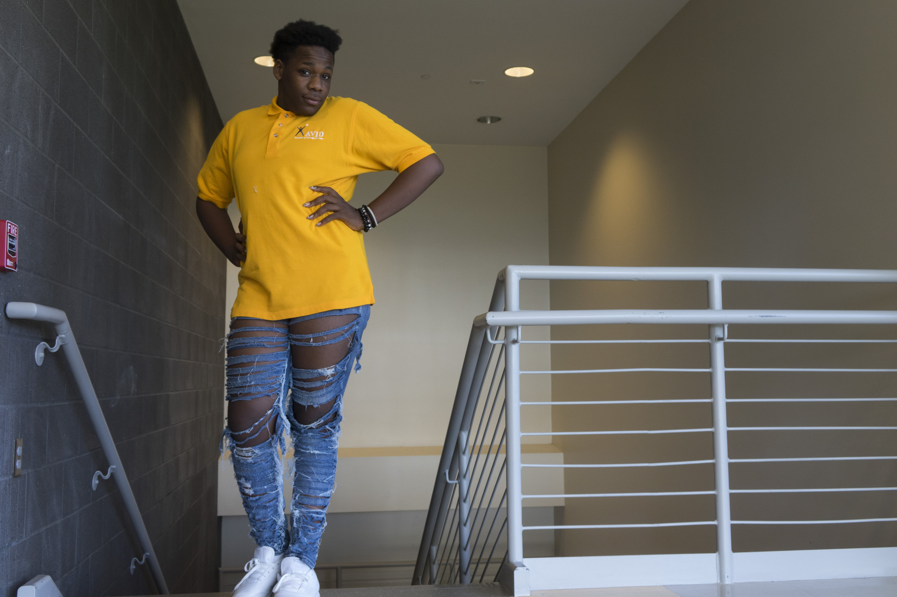

It’s been a long week for St. Dominic High School senior Emma Story. But as the sun sets on a Friday night, Story is out knocking on doors in St. Charles for the Missouri GOP.

Story is a first-time voter who spends most of her free time — when she’s not practicing on her high school’s golf team — trying to get Missouri Attorney General Josh Hawley and other Republicans elected. 

“I’m really excited to really have a direct voice or direct effect in democracy this year,” Story said. 

She’s not the only high school senior looking forward to voting this November. 

Battle High School junior DC Darks, 17, isn’t old enough to vote in this year’s election. He says he doesn’t follow politics closely. “I just don’t really care about it. If I do vote, I do vote. If I don’t, oh well,” says Darks, who spends most of his time dancing and preparing for college.

Credit: Aviva Okeson-Haberman / KBIA

Jefferson City High School senior Tiana Vaughan closely follows politics. Right now, she’s paying a lot of attention to Robert Mueller’s federal investigation of Russian government interference in the 2016 election. Vaughan wants to see Democrat Sen. Claire McCaskill get re-elected. 

“I've gone with my grandma to vote before, but I think it's gonna be a little bit different voting for myself,” Vaughan said. 

Both high school seniors are the type of engaged, young voters their respective parties may point to as an indicator that eligible high school students will cast a midterm ballot. But mid-Missouri high school teachers said, by and large, most of their students aren’t paying attention to the upcoming election. And while this year’s deadly school shootings have motivated some high school voters, other students still feel disconnected from the political process. 

Less than a third of young adults across the U.S. said they are “absolutely certain” they will vote in November compared to more than 70 percent of seniors, according to a June survey by the Public Religion Research Institute and The Atlantic. Young adults are defined in the survey as 18- to 29-year-olds. 

And if August’s primary is any indication, 18-year-old voters aren’t planning on showing up in droves. In Cole County, for example, about 17 percent of registered 18-year-olds went to the polls. The average turnout rate of registered voters was about 40 percent, according to a KBIA analysis of voting records. 

“Honestly, I don't know that most of them are even aware that there is an election coming up, ” New Franklin High School teacher Adam Quest said, adding later, “I haven't heard one single student talking about the Senate race nor do I have any sense that they know who's running.”

It’s not just high school teachers who notice this lack of engagement. McCaskill said she isn’t seeing young people volunteer for the campaign at the same level as older age groups. And she’s not sure why. 

“I wish they'd tell me. We're trying to figure it out,” McCaskill told KBIA after a recent campaign stop at Mizzou. “I think it’s that they don’t feel it’s as relevant to their lives as it really is.”

Melissa Smith, a teacher at Battle High School in Columbia, said her students just feel disconnected from the political process. 

“I think that they want things to change. I don't know how many of them can verbalize exactly what that means or would even understand how to go about choosing who to vote for,” Smith said. 

But high schoolers have taken some visible political stands recently on issues like school safety and gun control. This follows school shootings at Marjory Stoneman Douglas High School in Parkland, Florida, and Santa Fe High School near Houston. 

Vaughan participated in her school’s walkout to protest gun violence, and said school shootings and police brutality are two important issues for her.

“There were so many different shootings, and everybody was just kind of like, ‘Oh, pray for them,’ but there was nothing getting done,” Vaughan said. “And then with the one in Florida, they were doing marches, and I was like, ‘Yes, we're finally doing something.’”

Josie Johnson, a junior at Boonville High School, still has a couple more years before she’s eligible to vote. She said school safety is also something that’s on her mind, and doesn’t think all of the adults in her life understand her experience. 

“I feel like some of them haven't really had to be in that position to where they would like, sit in a classroom and be like, ‘Oh, like, hey, someone might end up walking in here with a gun,’” Johnson said. 

Bunceton High School senior Kayla Burnett doesn’t support additional regulations on guns, and said having a gun makes her feel safe. 

“We used to live where there were a lot of coyotes. We had a lot of chickens and they would come kill them. And I’ve had to shoot one before, at least scare one off,” said Burnett, who plans to vote. 

Second Amendment rights and limiting abortions are key issues for her, but when it comes to who she’ll be voting for, she admitted she’s still trying to figure it out. 

“I honestly don't know who Josh Hawley is,” Burnett said. 

Burnett isn’t following this vitriolic, high-stakes campaign. She’s not alone in that regard. But Burnett is exploring the issues that are important to her, and she has some time to figure it out. 
