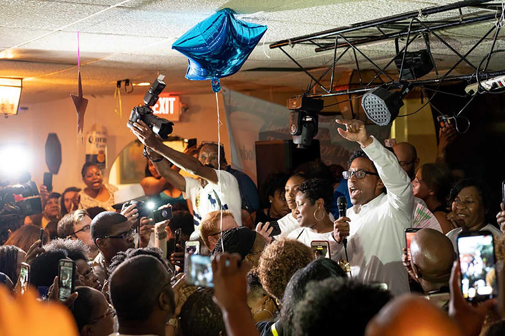

After the August primaries, it’s clear many people — young, black and progressive — played a major role in helping former Ferguson Councilman Wesley Bell defeat incumbent St. Louis County prosecutor Bob McCulloch in the Democratic race.

“We’re saying bye to Bob and ushering in, hopefully, a new era in prosecutor politics,” Rodney Brown said weeks before the primaries. He’s a member of a local committee of young, black progressives called St. Louis Action Council. 

“A lot of what St. Louis Action Council is trying to do is create a space where the issues that affect black people and black millennials most, this is a space where those ideas can be nurtured,” Brown said. 

Wesley Bell, who defeated the longtime St. Louis County Prosecutor Bob McCulloch, addresses an exuberant crowd at La Mexicana in St. Ann on Aug. 7, 2018.

Credit: David Kovaluk/St. Louis Public Radio

The group backed Bell because of his policies on community policing, drug courts and mental health treatment for nonviolent offenders. No Republican is on the Nov. 6 ballot to challenge Bell, so he essentially has the job.

Through meetings and digital campaigns, black activists in St. Louis called for criminal justice reform ahead of this year’s primary. Their efforts unseated McCulloch, who’d been in office for decades and played a major role in the [Michael Brown case](http://news.stlpublicradio.org/post/prayers-silence-mark-anniversary-brown-s-death-focus-rest-week-community-events) in 2014. 

It’s unclear, though, whether the strategies that helped Bell defeat McCulloch by more than 24,000 votes will work in the midterms — when voters, especially voters of color, may feel national candidates have little effect on what happens on the ground. 

“A lot of what we see as voter apathy or young people or black people not wanting to engage in the political process is because candidates aren’t speaking to us,” Brown said. 

But Bell did speak to them, he said. 

“When we look at the criminal justice reforms that are sorely needed in St. Louis County, I think it’s time for a change to effectuate policies that actually work; that keep us safer,” Bell said in an interview shortly after he launched his campaign in February.

Bell told St. Louis Public Radio the [day he filed for candidacy](http://news.stlpublicradio.org/post/few-surprises-missouri-s-2018-candidates-begin-filing-get-ballot#stream/0) he was ready to “bring that office into the 21st century” with community policing efforts and mental health treatment for nonviolent offenders. Those policies resonated with frustrated St. Louis young people of color who were challenging the city and county on issues of policing and incarceration.  

Brown believes some of the same issues are missing from national platforms from candidates hoping to represent the state at the national level. He criticizes national Republican and Democratic parties for using big money on other initiatives. 

“I mean, when I say candidates, I mean white candidates. You don’t see the same support for black women,” Brown said.

Overcoming the name recognition and popularity of established candidates is a tall order for grassroots activism. 

For example, Cori Bush is a St. Louis Democratic activist who gained local and national attention during the U.S. House primary. She also got notable endorsements from Democratic organizations that championed the likes of New York’s [Alexandria Ocasio-Cortez](http://news.stlpublicradio.org/post/and-coming-democrat-stumps-challenger-incumbent-st-louis-congressman) leading up to the primaries. But [Bush lost to an opponent](http://news.stlpublicradio.org/post/hawley-and-mccaskill-set-november-collision-course-clay-easily-beats-bush) with deeper roots in national politics. 

“That primary race was very different because her opponent was Lacy Clay and there is a large percentage of establishment Democrats, including some voters who are people of color who are very supportive of Lacy Clay,” said Washington University political science expert Clarissa Hayward, referring to the nine-term incumbent congressman. “He’s just a different opponent than the opponent Wesley Bell faced.”

Mobilizing black voters around the Bell-McCulloch primary presented less a challenge than trying to excite people about candidates who are household names or whose views are more bipartisan than those that polarize voters, such as with Sen. Claire McCaskill, Hayward said. 

“I think it’s difficult to take on the DNC (Democratic National Committee) at that level. It’s really different from taking on a county prosecutor,” Hayward said.

Hayward said a lack of enthusiasm could be the biggest hurdle to getting people of color to vote in the midterms.

With Bell, “there was both things. There was anger (stemming from Michael Brown’s death) and there was enthusiasm about an alternative candidate. With the Senate election, there’s probably a lot of anger on the left about Trump and among many millennials and people of color.” she said. “The enthusiasm may not be there. It would have to be a sense of urgency. A sense that this really an emergency.”

In Missouri, a state that largely supported Trump in 2016, Hayward said the same strategies that got St. Louis residents to vote in the primaries on local issues may not draw them out again for national races seemingly removed from high-stakes local issues.

But there is a local race that could have national implications that St. Louisans of color have shown interest in.

In Missouri’s 4th Senate District primary race, Democratic Rep. Karla May defeated incumbent Sen. Jake Hummel (D-St. Louis) by about 5,000 votes. Her victory came as a surprise. After all, Hummel had been the St. Louis Democratic Central Committee’s pick for state senate in 2016. If May wins in November she will be one of two black women, including Sen. Jamilah Nasheed, representing St. Louis. 

May has spoken out against Right to Work and supported an elected school board for St. Louis Public Schools. But a November win for May, and other state lawmakers, could not only have local impact but also national influence.

A [Washington Post analysis](https://www.washingtonpost.com/graphics/2018/politics/governors-redistricting/?utm_term=.cfbc5b09f12d) reports that Missouri is among dozens of other states whose Statehouse elections could have major influences on redistricting in coming years. New district maps ultimately affect Congressional representation.

May told St. Louis Public radio reporters Jason Rosenbaum and Jo Mannies in August concerning her primary win, “I feel like it’s 2018 and paradigm is changing--and I’m hopeful for the future.”    

_Ashley Lisenby is a reporter based in St. Louis and part of the public radio collaborative [Sharing America](http://sharingamerica.news), covering the intersection of race, identity and culture. This new initiative, funded by the Corporation for Public Broadcasting, includes reporters in Hartford, St. Louis, Kansas City and Portland, Oregon. Follow her on Twitter: [@aadlisenby](https://twitter.com/aadlisenby)._
