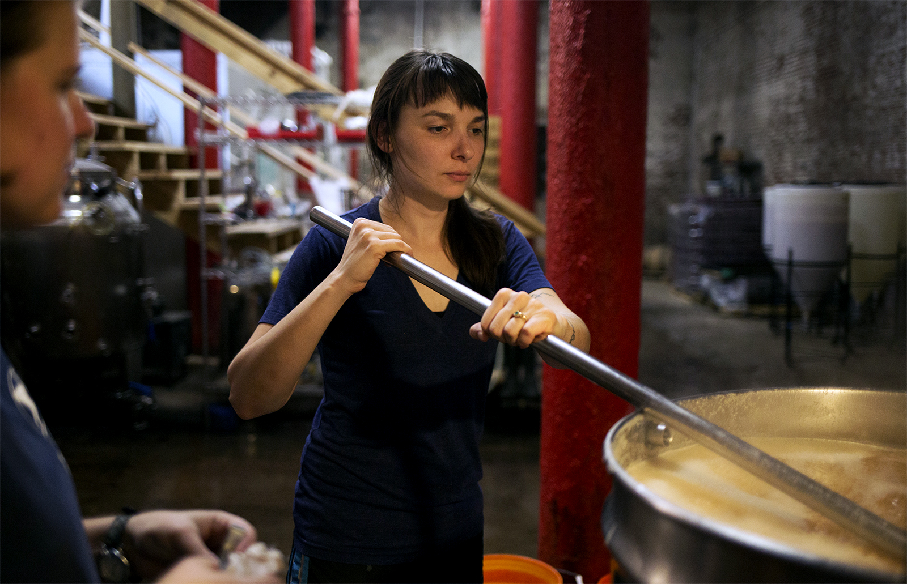

Less than two miles from the iconic Anheuser-Busch brewery in St. Louis, a startup with 11 employees is brewing small batches of beers with names like Dead Druid King (made with oak leaves instead of hops), Cucumber Pepper Kolsch and Ozark Common.

[Earthbound Beer](http://www.earthboundbeer.com/) occupies the site of a 19th-century brewery and fills several thousand aluminum cans each month in the limestone cellars 25 feet underground where brewmasters once kept their kegs cool with ice from the Mississippi River.

The modern micro-brewery has grown steadily since it was launched four years ago. Stuart Keating, a co-owner, said financing from a local development agency has been a big help, but he's feeling the pinch from policies in Washington. President Donald Trump’s tariffs on imported metals have raised the price of a beer can by as much as three cents.

“We’re the small guys so we’re going to get the price increases passed on to us,” he said. “That is one of the interesting things, if you don’t have any real purchasing power, you’re at the absolute mercy of all price increases.”

In fact, the “small guys” are often called the growth engine of the U.S. economy. Small businesses employ nearly half of the private workforce and equal 99 percent of all businesses in Missouri and across the nation. Despite those numbers, it’s difficult for such a large and diverse sector to speak with one voice.

[St. Louis Pneumatic](https://www.stlouispneumatic.com/), a manufacturing company, is located in an industrial park in Fenton. Its owner has a very different take on the tariffs on imported metals. Dan Hurt said his company is one of the last American manufacturers of professional-grade ratchets and pistol grip drills. His biggest competitor is China.

“Tariffs will probably help me because all raw material we use is from the U.S. or Canada,” he said. “In the long-run, tariffs will reset the trade imbalance with China and encourage more U.S. manufacturing.”

For now, Hurt is looking for elected officials to pay attention to concerns he shares with other local manufacturers who are committed, like he is, to using American materials and stamping “Made in America” on their products.

“The main ones at the top are labor, the benefits, and the capitalization,” he said. “Those are the key issues, in my opinion.”

Hurt says capitalization — borrowing money — to pay for a piece of equipment that can cost as much as house isn’t always easy. He blames federal banking regulations as an obstacle to loans.

A recent [survey](https://www.uschamber.com/sbindex/summary/) of small business owners conducted by the U.S. Chamber of Commerce found that access to capital is improving. But business owners aren't totally split on the issues. One area of common concern is the need for skilled workers. An [annual survey](https://www.stlcc.edu/workforce/st-louis-workforce/sslw2018-report-download.aspx) of business owners in the St. Louis region, conducted by St. Louis Community College, has found for the past three years that a shortage of workers with knowledge and skills has been the most frequently cited barrier to adding jobs.

Nicole Adewale is principal and president of the [ABNA Engineering](http://www.abnaengineering.com/) firm in St. Louis. Her firm has 90 employees who design and construct infrastructure projects such as sewer lines, roads and bridges. With the current low unemployment rate and a tight labor market, she said it’s very difficult to find skilled workers.

Adewale said part of the solution is better education.

“We need to make sure that we're looking at improving our public as well as private schools, but primarily focusing on our public K-12 education,” she said. “We must improve graduation rates and improve the number of students who are able to enter either workforce training, military, or college.”

Her involvement in several programs encouraging students to study STEM (science, technology, engineering, mathematics) subjects has convinced her that multi-discipline training should start as early as fourth grade to prepare the next generation of workers.

“There are jobs now we didn't even think would exist ten years ago,” Adewale said pointing to changes in technology. “And so the point is, we need to have a well-trained workforce that's very flexible who can maybe morph into a couple of different things.”

Back at Earthbound Beer, Keating agrees education is important but had a few more issues he would like elected officials to address.

“I would like to see increased funding for childhood wellness and universal healthcare, and an increased minimum wage. These are really basic quality of life improvements that would go a long way toward helping me as a small business owner,” he said.

Keating admits it’s a long and ambitious list, but he's bullish on the future of craft breweries and said there’s room for more to enter the market.

And he’s not alone. A national [survey](https://www.uschamber.com/sbindex/summary/) by the U.S. Chamber of Commerce found that small business owners are extremely optimistic about the economy. It found that nearly 70 percent of small business owners “have a positive outlook about their company and the small business environment in the United States.”

_Melody Walker is the business reporter for St. Louis Public Radio. Follow her on Twitter: [@melodybird](https://twitter.com/melodybird)_
